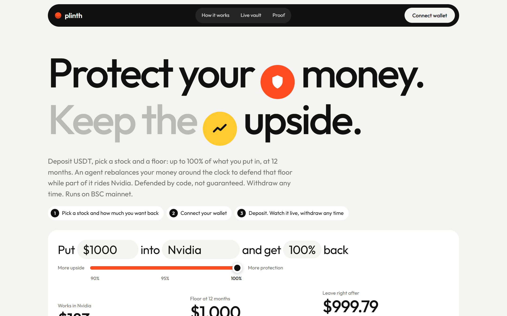
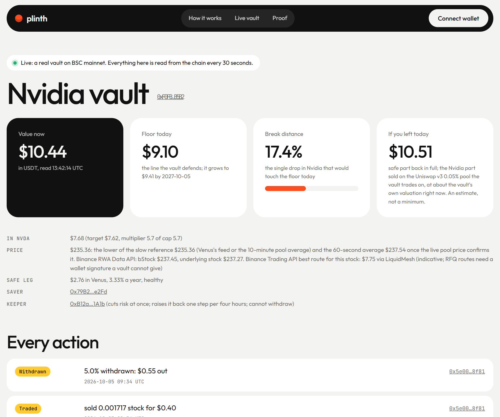

<p align="center">
  
</p>

<h1 align="center">Plinth</h1>

<p align="center">
  <b>Protect your money. Keep the upside.</b><br>
  Savings on tokenized US stocks with a floor under them, on BSC mainnet. An agent rebalances around the clock to defend it.
</p>

<p align="center">
  <a href="https://plinth-savings.vercel.app"></a>
  <a href="https://bscscan.com/address/0x271cb3B56E133cd3488AB31e99766A288bC8DCe5"></a>
  <a href="https://plinth-relay.vercel.app/agent/keeper"></a>
  <a href="https://github.com/jenzylove/plinth/actions/workflows/ci.yml"></a>
  <a href="https://www.bnbchain.org/en/hackathons/tokenized-stocks"></a>
  <a href="LICENSE"></a>
</p>

<p align="center">
  
</p>

Tokenized stocks trade all night and all weekend. A saver who wants the upside of a stock but cannot stomach losing
the savings has had one answer so far: stay out. Banks sell this product to millions of people as a capital protected
note. Plinth is that product on BSC, enforced by a contract instead of a bank desk, with one thing a desk cannot do:
act at 3am on a Sunday.

You deposit USDT, pick a stock and a floor (up to 100% of what you put in, at 12 months). Part of the money rides the
stock. The rest earns interest on Venus or Aave. When the stock falls, an agent moves money toward safety by itself.
You can leave at any time at today's value. The floor is defended by rules, not guaranteed, and the page says so next
to the deposit button.

<p align="center">
  
  <br><sub>A real vault on mainnet. Every number is read from the chain, and every action links to its transaction.</sub>
</p>

| | |
|---|---|
| Demo video (3:30) | https://youtu.be/tCO9HDtvVmQ |
| Live site | https://plinth-savings.vercel.app |
| A real vault, real money | https://plinth-savings.vercel.app/demo |
| Proof: backtests, fork replays, off hours data | https://plinth-savings.vercel.app/proof |
| The keeper agent, live state and uptime | https://plinth-relay.vercel.app/agent/keeper |
| Contracts (v3, verified) | [docs/DEPLOYMENTS.md](docs/DEPLOYMENTS.md) |
| Two reviews and every fix | [docs/AUDITS.md](docs/AUDITS.md) |
| Security model and how to report | [SECURITY.md](SECURITY.md) |
| Agentic Wallet skill: "protect $50 in Nvidia" | [skills/plinth/SKILL.md](skills/plinth/SKILL.md) |
| Raw developer experience log | [docs/DX_LOG.md](docs/DX_LOG.md) |

## Judge fast path

Five minutes, no keys, no wallet.

1. Open [/demo](https://plinth-savings.vercel.app/demo). This is a real vault with real money. Value, floor, the single drop that would touch the floor, the exit estimate on the vault's own pool, and every action with a BscScan link.
2. Open the [front page](https://plinth-savings.vercel.app) and move the sliders. The rates, caps and limits are read from Venus and the factory as you move them.
3. Open [/proof](https://plinth-savings.vercel.app/proof). Ten years of every stock, real contracts replayed through Nvidia's worst gap next to two bank desks, and three months of real bStock prices from while New York was shut.
4. Read the agent's own counters: `curl https://plinth-relay.vercel.app/agent/keeper` (passes, longest gap, gaps over five minutes). Ask it about a vault in plain words: `curl "https://plinth-relay.vercel.app/api/plan?action=status&vault=0xF0FB407210944A577949eA7Cc3031B542740B5B2"`.
5. Run the tests yourself (commands below). Every audit fix has a regression that runs on a fork of BSC mainnet.
6. With a wallet: connect, approve, open. Or use the Agentic Wallet skill and say it in words.

## What is real and what is not

| Part | Status |
|---|---|
| Contracts | Live on BSC mainnet, verified on Sourcify (exact match). Three versions shipped, each fixing a review. No third party audit. |
| Demo vault | Real USDT. Opened, partly withdrawn and migrated between versions from a Binance Agentic Wallet with Developer Mode contract calls, each previewed first. |
| Keeper agent | Live. Passes every minute on a container host. ERC-8004 identity #363619. One ERC-8183 job negotiated, funded and delivered on mainnet (job 56898). |
| Keeper acting on an event | On mainnet, on the earlier vault: it cut the multiplier from 5.7 to 4.2 before the US jobs report on 2 October ([cut](https://bscscan.com/tx/0x5df16b833af45c65ee885b2e95062d03f148431f46a775d91b37b3d4d612ab6a), [restore](https://bscscan.com/tx/0xe038a44a07abfd65eba167c71a21837dd03230c7266fdeca3a8782bc1b68a0f8)). No scheduled event falls before the submission deadline. The next is US CPI on 14 October at 12:30 UTC, during judging: the agent will cut the demo vault's multiplier from 00:30 UTC that day and raise it back one step every four hours after 13:30 UTC, all on the [vault page](https://plinth-savings.vercel.app/demo). |
| Crash response | Measured on a fork of mainnet, not on mainnet: a 10% fall in one block is sold within about a minute. The tests are in the repo. |
| Off hours study | Real bStock prices from the Binance Web3 API, three months. Hourly bars stand in for the contract's minute scale rule, and the page says so. |
| Backtest | Daily prices, ten years, multipliers chosen on the same history (in sample). Labelled on the proof page. |
| x402 | Hosting was paid once over x402 from the agent's wallet. That host never started, so the agent runs elsewhere. The paid report rail is not switched on: it needs a Binance Onchain Pay merchant account. The ERC-8183 report is priced at $0.01 USDT and works. |

## Track by track

**Main track: tokenized stock products and agents.** bStocks are the stock leg: 20 of them, each with its own pool, fee tier, multiplier and trade limits. Spot only. The agent is built for the track's scoring: fixed code signs, the model never touches money, every action is public.

**Best use of Agentic Wallet.** The wallet's AI layer is the front door for people who do not want a website. The [Plinth skill](skills/plinth/SKILL.md) turns "protect $50 in Nvidia at 95%" into exact contract calls. The wallet previews each one (the simulation, the balance change, the risk list), the saver confirms, the wallet executes. Proven end to end on mainnet: [a withdrawal run through the skill](docs/spikes/agentic-deposit.md).

**Best use of BNB Agent Studio.** The keeper is a Studio agent with an ERC-8004 identity, an A2A card and an ERC-8183 seller. It holds the factory's keeper role, so it is the thing that actually defends savers' vaults. It publishes its own uptime counters. What is not done: it does not yet sell reports over x402, and its first host (NodeOps) never started after four deployments in two modes (the log has the evidence).

## How the Binance Web3 API is used

| Module | Role in Plinth |
|---|---|
| RWA Data | Trading status and pause codes feed the agent's event policy. The bStock price and the underlying reference price sit on every vault page. |
| Market | Hourly candles for each held stock. When the last day of moves runs at twice its usual size, the agent cuts risk to 70% of the cap until it calms. Medians, so one bad print cannot trigger it. |
| Wallet | When a saver connects, the page shows what the wallet already holds: USDT, and any bStocks held outright with no floor under them. |
| DeFi | Ranks every USDT earn product on BSC on the front page. The vault's own health gate chooses between Venus and Aave onchain. |
| Trading | Aggregated quotes, shown as an indicative best price. The vault trades only on its fixed PancakeSwap or Uniswap pool (aggregator routes for stocks need a wallet signature a contract cannot give), so exit estimates quote that pool. |
| Transaction | Every keeper write is simulated here before it is sent. A FAIL blocks it. If the API is down, the onchain simulation stands and the action records that. |

All calls go through a small relay in Singapore ([relay/](relay/)), because the API refuses US addresses. The relay allows an exact list of read endpoints and simulations of Plinth's own contracts. It never signs or sends anything.

## How it works

CPPI, the method banks have used for decades, enforced by a vault contract, one per saver.

- **The floor.** Today's floor is the promise discounted at today's lending rate. What sits above it is the cushion.
- **The stock part.** Only a multiple of the cushion goes into the stock: `target = min(total, multiplier x cushion)`. A stock's multiplier is the highest one that never ended a ten year window below the floor, capped at 6.
- **The safe part.** The rest is lent on Venus core or Aave v3 behind a health gate: cash, utilization, pauses, the USDT feed. If a market fails the gate the vault leaves it. If a market will not pay out, the vault keeps tracking the position and only sells stock until it does.
- **The agent.** It rebalances drifting vaults, cuts risk before earnings and US macro releases, and pulls the safe part out of unhealthy markets. It can cut the multiplier at once and raise it back one step per four hours. It can never withdraw. Anyone can rebalance, so vaults stay defended if the agent is down.
- **Around the clock.** The vault values the stock at `min(slow reference, max(60 second average, live pool price))`. A fall that lasts is sold within about a minute. A bad print that recovers is ignored. A spike is never chased.

**When the floor fails:** if the stock falls more than the break distance before anyone can trade, if the lending market fails faster than the gate, if USDT loses its peg, or if the contract has a bug. Rates float: if they fall, the floor rises and less stays in the stock. Leaving early returns today's value, not the promise.

## Why only here

bStocks trade through the night on deep BSC pools, and the lending markets that pay interest on the safe part live on the same chain, so one transaction splits a deposit between a stock and a loan and an agent can move it at any hour.

## The business in one number

**0.0001 BNB.** That is the gas to open a protected position (1.44 million gas at 0.07 gwei, measured on mainnet). A withdrawal costs 0.00004 BNB. A risk cut by the agent costs 0.0000024 BNB. Watching a vault every minute costs nothing, because reading is free and the agent only pays when it acts.

## What is live right now

| | |
|---|---|
| Agent | `curl https://plinth-relay.vercel.app/agent/keeper` shows its passes, its longest gap and any gaps over five minutes since its last start |
| Demo vault | https://plinth-savings.vercel.app/demo |
| Next scheduled cut | US CPI, 14 October 12:30 UTC. Watch the demo vault's multiplier drop from 00:30 UTC and come back after the release |
| Factory | [0x271cb3B5…DCe5](https://bscscan.com/address/0x271cb3B56E133cd3488AB31e99766A288bC8DCe5) |

## Run it

```bash
git clone --recurse-submodules https://github.com/jenzylove/plinth && cd plinth

# contracts: math tests, then the fork tests against BSC mainnet (any archive RPC)
cd contracts && forge test --match-contract FloorMathTest
BSC_ARCHIVE_RPC_URL=https://bsc-mainnet.public.blastapi.io forge test --no-match-contract ReplayLab

# keeper: policy and isolation tests, then one read only pass against mainnet
cd ../packages/keeper && npm ci && npm test
BSC_RPC_URL=https://bsc-dataseed1.defibit.io npx tsx src/cli.ts --once

# the site
cd ../../app && npm ci && npm run dev
```

The fork tests need an archive RPC with a real rate limit (the free one above is enough on a laptop, but it answers 429 to shared CI runners, so CI runs them only on demand with your own key). The fast checks run on every push. The fork suite opens and closes all 20 stocks, sells into crashes, reduces risk in chunks, and runs every audit regression ([contracts/test/AuditFixes.t.sol](contracts/test/AuditFixes.t.sol)). The replay lab ([contracts/test/ReplayLab.t.sol](contracts/test/ReplayLab.t.sol)) replays real Nvidia paths against the real contracts next to two bank desks.

## Repository

| Path | What |
|---|---|
| [contracts/](contracts/) | Vault, factory, CPPI math, safe leg and stock leg libraries, fork tests, deploy script |
| [packages/core/](packages/core/) | CPPI math in TypeScript, calibration, backtests, the off hours studies |
| [packages/keeper/](packages/keeper/) | The keeper pass: event policy, per vault isolation, simulation |
| [agent/plinthkeeper/](agent/plinthkeeper/) | The Agent Studio project that runs the keeper |
| [app/](app/) | The site |
| [relay/](relay/) | Web3 API relay, vault history, agent endpoint, RPC router, the planner behind the skill |
| [skills/plinth/](skills/plinth/) | The Agentic Wallet skill |
| [data/](data/) | Every dataset behind a number on the site, with its source and date |
| [docs/](docs/) | PRD, deployments, audits, research, developer experience log |

MIT licensed.
